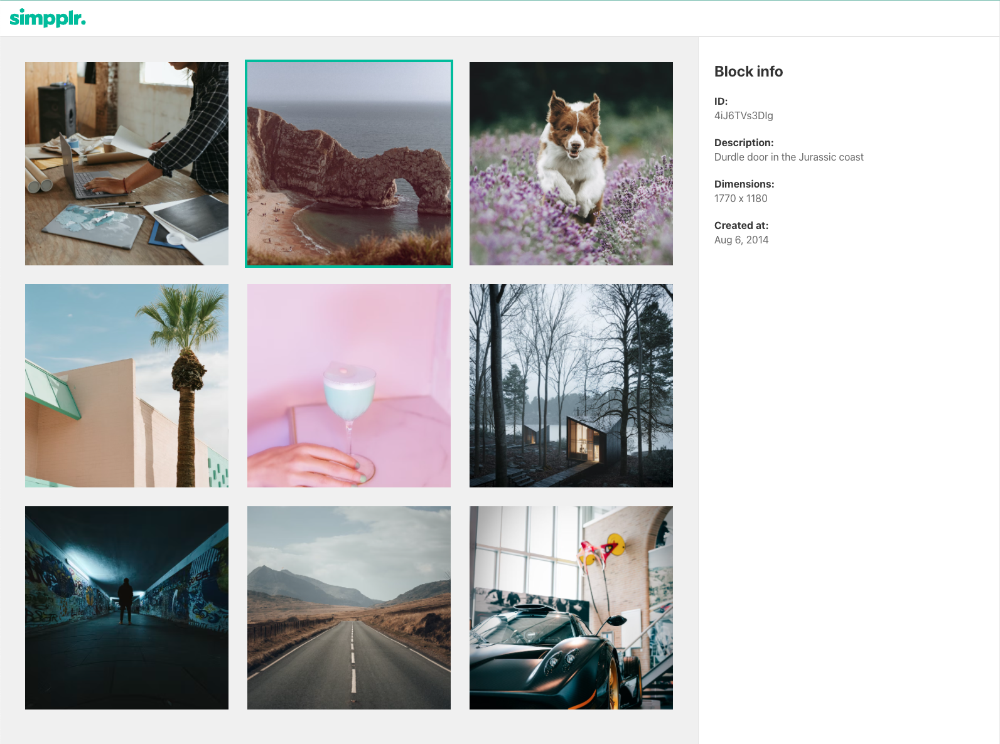

# Welcome to the Simpplr FE test

We've include a similar data structure from our production application. This is a simplified representation of blocks in our drag and drop block editor

Each block has:

1. A unique string ID
2. A type - for simplicity we've only included PlainText and Image
3. options - an object literal which configures how the block should look and behave
4. data - an object literal where a block can store arbitrary data it needs, this could be the original dimensions of an image or the text in a block.
5. children - an array of child blocks. Blocks can be nested inside of each other a bit like the DOM.

## What do we want you to do?

1. Want you to use the function `getBlocks` that is included in `App.tsx` to
   mimic fetching data from a server which returns a promise of the type
   `Block`.
2. While waiting for the promise to resolve we want to show a loading state.
3. Once resolved, display a grid of all the images inside the ImageGrid component
   matching the design supplied, you will need so recursively loop through the block structure.
4. When clicking on any of the images in the grid, it updates the URL to include the `id` e.g. http://localhost:3000/blockId.
5. Add a blue border to the selected image and display the details of the
   selected item in the `InfoPanel`, again matching the design.

## What are we looking for?

We'll be judging you on the following:

- Clear, concise, readable JavaScript or TypeScript - use whatever you're most comfortable with.
- A functional approach to solving problems.
- Attention to detail, matching the provided designs.
- Robust tests that cover more than just the happy path.
- Semantic, accessible HTML.
- Well written types for functions, variables and data structures (if you're using TS).

## Before you begin

Firstly, **create a branch for your work** - you will be submitting via a Pull Request so it's important you work in a separate branch. It doesn't matter what you call it.

This repository fork has been created specifically for you - no other candidates will be able to see your work.

The rules for this exercise are as follows:

1. Only work inside the `src/` directory.
2. We don't want you to spend time majorly refactoring the project structure or tweaking configuration. We're testing your React skills, not where you keep components.
3. Make no changes to the `getBlocks` function, `index.css` or `index.tsx`.
4. Feel free to use 3rd party libraries to help you.
5. Try to make small, atomic commits (i.e. for each change) so we can see how you work more easily.
6. Aim for 2 hours but feel free to take more. We are looking for quality over quantity.

## Running the application

After you've cloned your branch locally, you need to run it. We use Yarn as our package manager of choice. We've setup some scripts to get you started:

```
# install dependencies
yarn

# run the application
yarn start

# run test
yarn test
```

## Submitting your work

When you're ready to submit you should create a Pull Request to merge your
branch into main.
Once you've made the Pull Request, feel free go through the diff and add any inline comments to explain your thinking and approach to solutions.

Once that's done, send a link to the pull request to your interviewer so we know your work is ready to be reviewed.

## Design


